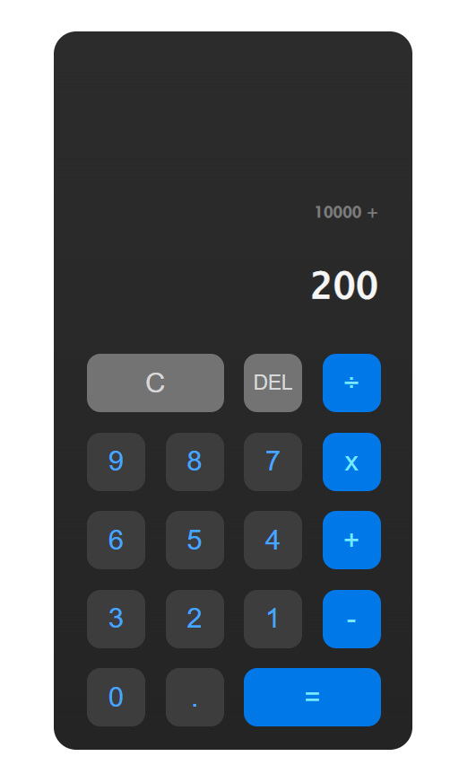

# Windows style Calculator

### Language(s):

  

A calculator program developed to better understand the JS concepts. 
Click the link below to check it out 👇🏼

https://lasanseniya.github.io/calculatorJS/

